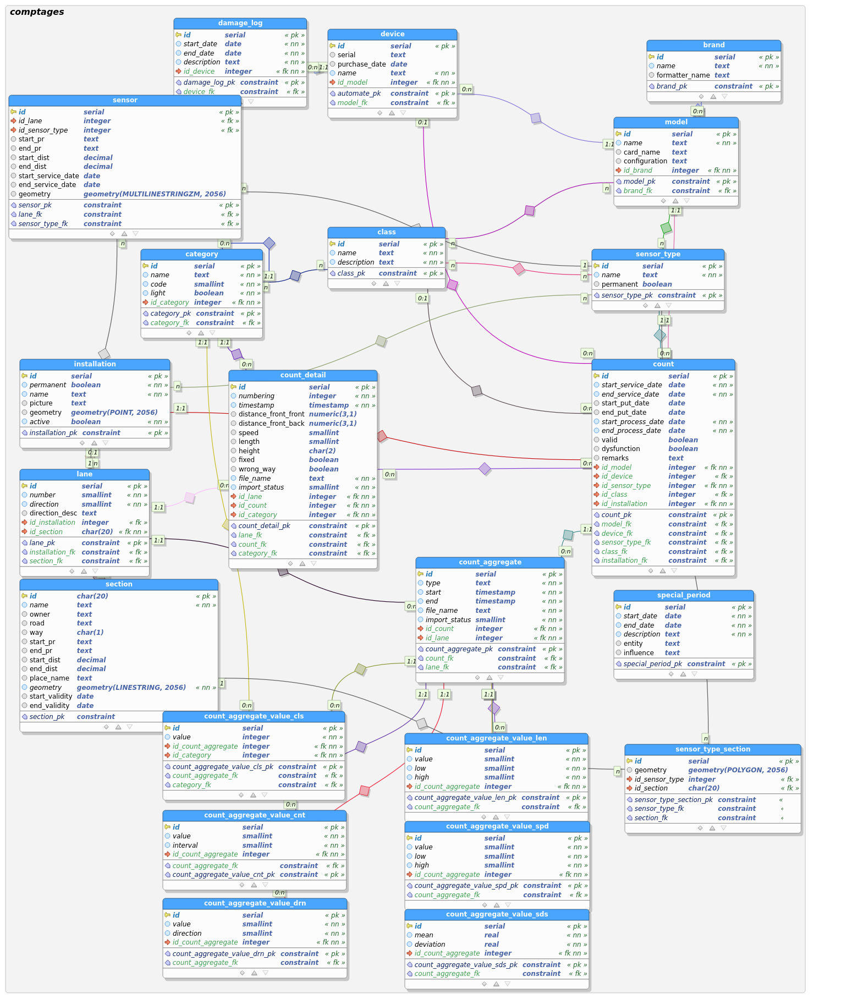

# Development

## Upgrade dependencies

__Disclaimer__: This section presupposes that you are using a version of `pip-tools` matching your Python interpreter. In other words, if you want to upgrade or pin dependencies for Python 3.9, `pip-tools` need to be downloaded for Python 3.9, which in turn means that if you use `pip`, you need to use `pip` for Pyhton 3.9.

Make sure you have `pip-tools` installed -- ideally in a virtual environment at the root of the project. Then run

    pip-compile --upgrade

In case something goes south, you can re-generate `requirements.txt`, which amounts to pinning the dependencies described in `requirements.in` and constrained by `pyproject.toml` to a version matching the project's configuration:

    pip-compile -o requirements.txt pyproject.toml
    
Now `pip-compile --upgrade` should work.

## Data model
The data model has been created to easily allow to add functionality to the product
e.g. adding new vehicle classes and to be as simple as possible and easily
usable into QGIS. It is flexible enough to support natively all the current
special cases without write special management code.

The data model is created with `pgmodeler` and is exported into an sql script
used by `create_db.sh` script. To create a new sql from the pgmodeler's model,
run the script `create_data_model_sql_script.sh`.

<figure>
  
  <figcaption>Data model</figcaption>
</figure>

## Repository structure
   | Directory  | Content                                                                                                                                                    |
   |------------|------------------------------------------------------------------------------------------------------------------------------------------------------------|
   | .docker/   | docker-compose files to run a development environment (i.e. PostGIS db) or a test environment (i.e. PostGIS db and QGIS to allow using QGIS API in Travis) |
   | comptages/ | root directory of the QGIS plugin (for more details see the "Code Structure" section)                                                                      |
   | db/        | contains the sql files to create the database structure and a dump of the initial data                                                                     |
   | docs/      | contains the user manual that is published online using Github Pages                                                                                       |
   | scripts/   | contains useful scripts to launch docker enviroments, run tests, create the database, etc                                                                  |

## Code structure

The code of the plugin (directory =comptages=) is structured in the following way:

   | Directory /File     | Content                                                                            |
   |---------------------|------------------------------------------------------------------------------------|
   | chart/              | python package used to generate the charts                                         |
   | config/             | python package used to generate the device configurations                          |
   | core/               | python package with core functionality modules                                     |
   | data/               | python package used to collect the data from the db to report and chart generation |
   | ics/                | python package used to manage .ics (calendar) files                                |
   | images/             | contains the images used by the plugin                                             |
   | importer/           | python package with the modules to import data                                     |
   | plan/               | python package for the plan generation                                             |
   | qgissettingmanager/ | qgis_setting_manager submodule to manage settings                                  |
   | qml/                | contains QGIS layer style files                                                    |
   | report/             | python package for the report generation                                           |
   | test/               | python package with unit and functional tests                                      |
   | ui/                 | contains QT's files with the definition of the user interface dialogs              |
   | comptages.py        | plugin main module                                                                 |
   | metadata.txt        | plugin metadata                                                                    |

