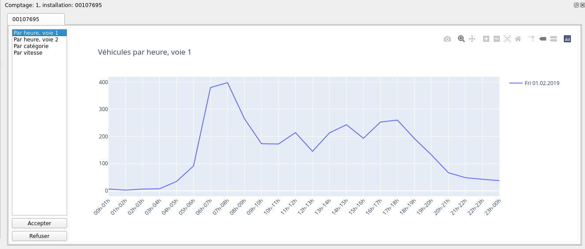

# Plugin QGIS
## Barre d'outils
Le plugin, une fois installé, ajoute une barre d'outils à l'interface QGIS,
composée de plusieurs boutons qui permettent d'effectuer différentes
opérations.

<figure>
  
  <figcaption>Barre d'outils du plugin</figcaption>
</figure>

Les outils sont, dans l'ordre :

- Connection DB
- Créer un nouveau comptage
- Modifier un comptage
- Importation données
- Validation données
- Filtrage
- Importation fichiers ICS
- Rapport annuel
- Réglages

## Utilisation
### Connection DB
<figure>
  
  <figcaption>Bouton connection DB</figcaption>
</figure>

Le bouton `Connection DB` ouvre une connexion à la base de données et charge
les couches de l'application dans QGIS.

<figure>
  
  <figcaption>Couches dans QGIS</figcaption>
</figure>

### Créer un nouveau comptage
<figure>
  
  <figcaption>Bouton creation nouveau comptage</figcaption>
</figure>

Pour créer un nouveau comptage (élément dans la couche `comptage`), il
existe l'outil `Créer un nouveau comptage` qui simplifie l'opération par
rapport à l'insertion manuelle dans la table.

Pour créer un nouveau comptage à l'aide de l'outil, vous devez commencer par
sélectionner un tronçon sur la carte en utilisant les outils de sélection de
géométrie QGIS normaux. Pour simplifier la recherche du tronçon à
sélectionner, vous pouvez utiliser l'outil de recherche dans la couche
`tronçon`.

Une fois que vous avez sélectionné le tronçon pour lequel vous voulez créer
le comptage, en appuyant sur le bouton `Créer un nouveau comptage` vous
pouvez entrer les données du comptage et les sauvegarder dans la base de
données.

<figure>
  
  <figcaption>Creation d'un nouveau comptage</figcaption>
</figure>

### Modifier comptage
<figure>
  
  <figcaption>Bouton modifier comptage</figcaption>
</figure>

Après avoir sélectionné un tronçon sur la carte, appuyer sur le bouton
`Modifier comptage` affiche le tableau d'attributs de la couche `comptage` avec
les comptages du tronçon sélectionné où vous pouvez éditer les données du
comptage.

<figure>
  
  <figcaption>Modification d'un comptage</figcaption>
</figure>

### Importation
Vous pouvez importer des données de deux manières différentes. Soit en spécifiant directement à quel comptage ils appartiennent, soit en important un ou plusieurs fichiers, laissant le programme déterminer à quel comptage ils appartiennent sur base de la date et du tronçon sur lequel le comptage est effectué. Pour importer un seul fichier associé à un comptage, utilisez l'action "Importation" de la table attributaire de la couche "comptage" et sélectionnez ensuite le fichier à importer.
<figure>
  
  <figcaption>Actions comptage</figcaption>
</figure>

Pour importer un ou plusieurs fichiers et laisser le système identifier à quel comptage ils appartiennent, utilisez le bouton "Importation" de la barre d'outils.
<figure>
  
  <figcaption>Bouton importation données</figcaption>
</figure>

Une fois que les données ont été importées, une fenêtre apparaît qui présente graphiquement les données importées (par heure et voie, par catégorie et par vitesse), de sorte que vous pouvez évaluer d'un coup d'œil si les données semblent correctes et décider de les importer définitivement dans la base de données ou de les écarter.
<figure>
  
  <figcaption>Validation des données</figcaption>
</figure>

La fenêtre de validation des données peut être appelée à l'aide du bouton approprié de la barre d'outils et montrera toutes les données qui ont été importées mais pas encore validées.
<figure>
  
  <figcaption>Bouton validation</figcaption>
</figure>

### Filtrage
<figure>
  
  <figcaption>Bouton filtrage</figcaption>
</figure>
Le bouton "filtrage" de la barre d'outils permet de filtrer les "comptages" qui sont affichés sur la carte (couche "comptage"). Vous pouvez filtrer par date de début, date de fin, type d'installation (permanente ou périodique), type de capteur (tube, boucle, ...), TJM, axe et secteur.
<figure>
  
  <figcaption>Options filtrage</figcaption>
</figure>

### Importation fichiers ICS
<figure>
  
  <figcaption>Bouton importation fichiers ICS</figcaption>
</figure>
Le bouton "Importation ICS" vous permet de charger un fichier calendrier ICS depuis votre ordinateur avec des périodes spéciales définies (vacances et jours fériés) à prendre en compte dans les rapports.

### Réglages
<figure>
  
  <figcaption>Bouton réglages</figcaption>
</figure>
Le bouton "Réglages" de la barre d'outils vous permet de spécifier les options du programme. En particulier les données de connexion avec la base de données et les répertoires par défaut où rechercher ou sauvegarder les fichiers.

<figure>
  
  <figcaption>Réglages</figcaption>
</figure
>
### Rapport annuel
<figure>
  
  <figcaption>Bouton rapport annuel</figcaption>
</figure>
Le bouton "Rapport annuel" de la barre d'outils vous permet de générer un rapport annuel d'un tronçon.
Vous pouvez sélectionner l'année et le tronçon souhaités.

<figure>
  
  <figcaption>Options rapport annuel</figcaption>
</figure>


### Exporter la configuration

Dans la table attributaire de la couche `comptage`, vous pouvez effectuer des actions sur les comptages présents. L'une de ces actions est la génération de la configuration de l'appareil de mesure. 
<figure>
  
  <figcaption>Actions comptage</figcaption>
</figure>

La configuration générée dépend du modèle de dispositif défini pour le comptage. Vous pouvez ajouter une partie de configuration fixe pour un modèle spécifique dans la couche `modèle` champ `configuration`.

<figure>
  
  <figcaption>Configuration fixe</figcaption>
</figure>

### Créer un rapport
Dans la table attributaire de la couche `comptage`, vous pouvez effectuer des actions sur les comptages présents. L'une de ces actions est la génération du rapport du comptage. 
<figure>
  
  <figcaption>Actions comptage</figcaption>
</figure>

### Créer un plan de pose
Dans la table attributaire de la couche `comptage`, vous pouvez effectuer des actions sur les comptages présents. L'une de ces actions est la génération du pland de pose. 
<figure>
  
  <figcaption>Actions comptage</figcaption>
</figure>


### Visualiser les graphiques d'un comptage
Dans la table attributaire de la couche `comptage`, vous pouvez effectuer des actions sur les comptages présents. L'une de ces actions est la visualisation des graphiques du comptage. 
<figure>
  
  <figcaption>Actions comptage</figcaption>
</figure>

Des graphiques sont générés et affichés dans une fenêtre.
<figure>
  
  <figcaption>Graphiques d'un comptage</figcaption>
</figure>

### Ajouter un nouveau automate
La table `device` (chargée dans la couche automate de QGIS), contient la liste des dispositifs disponibles. Chaque dispositif doit avoir une référence à un modèle défini dans la table `model`. Pour ajouter un nouveau dispositif, il suffit d'ajouter dans QGIS un élément à la table `automate` (et éventuellement à la table `model`).

### Cas spéciaux
Les installations considérées comme des `cas speciaux`, sont des installations où plusieurs voies de sections différentes sont mesurées à partir de la même installation. Chaque voie a une relation (foreign key) avec une installation. En attribuant plusieurs voies à la même installation, il est possible de créer des cas speciaux. 
Ces tables ne sont normalement pas chargées comme des couches dans QGIS, donc normalement ces changements sont faits directement dans la base de données.

Par exemple, l'installation `53409999` est composée de 4 voies sur 4 tronçons différentes. Les tronçons sont: `53410005`, `53420005`, `53430005` et `53440005`.
Dans la base de données, les 4 voies ont une relation (foreign key dans le champ id_installation) avec la même installation.
Si nous regardons les données de ce cas spécial dans la base de données, nous verrons quelque chose comme ceci :

``` postgres
select l.id, l.id_section, l.id_installation, i."name"from lane as l
join installation as i
    on l.id_installation = i.id
    where i.name = '53409999'
```
| id    | id_section | id_installation | name     |
|-------|------------|-----------------|----------|
| 17526 | 53410005   | 8770            | 53409999 |
| 17527 | 53420005   | 8770            | 53409999 |
| 17528 | 53430005   | 8770            | 53409999 |
| 17529 | 53440005   | 8770            | 53409999 |

### Ajouter une nouvelle class

<figure>
  
  <figcaption>Relation entre classe et catégorie</figcaption>
</figure>

Pour créer une nouvelle classe, il faut créer un élément dans la table `class` et des catégories dans la classe `category`, puis il faut les relier dans la table `class_category`.
